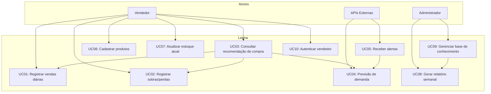

## Leena – Assistente Inteligente para Vendedores Informais

Leena é uma assistente de compras e vendas criada especificamente para comerciantes de mercados informais em Moçambique, começando por Maputo. O seu objetivo é ajudar a decidir o que comprar, em que quantidade e quando, reduzindo desperdício e aumentando a rentabilidade.

---

### 📦 O que a Leena faz

- **Recomendação personalizada** – baseada no histórico do próprio vendedor, clima, dia da semana, época do mês e feriados.
- **Alerta de risco** – avisa quando há probabilidade de sobra ou perda (ex: chuva prevista para alface).
- **Interface por WhatsApp** – canal já conhecido e utilizado pelos vendedores informais.
- **Aprendizado contínuo** – registos diários simples (“sobra: 3 kg cebola”) alimentam o modelo.

---

### 🎯 Valor para o utilizador (vendedor)

- **Menos desperdício** – compras ajustadas à procura real.
- **Maior lucro** – melhor giro de mercadoria.
- **Decisões com confiança** – dados em vez de “olhómetro”.
- **Alertas proactivos** – antecipa-se ao clima e a feriados.

---

### 👥 Público-alvo

- Vendedores de frutas, legumes e vegetais em mercados informais de Maputo (Xipamanine, Zimpeto, Janete, Praça dos Combatentes).
- Vendedores ambulantes que usam o WhatsApp como ferramenta de negócio.
- Pequenos comerciantes sem acesso a sistemas ERP.

---

### 🧠 Como funciona (visão técnica)

A Leena combina um motor de **Retrieval-Augmented Generation (RAG)** com embeddings e um modelo de linguagem para gerar recomendações simples e humanizadas.

```
1. O vendedor envia uma mensagem de WhatsApp (texto ou áudio).
2. A mensagem é recebida pela Evolution API (self‑hosted).
3. O backend (Node.js) identifica o vendedor e obtém:
   - Histórico de vendas e perdas (últimos 30 dias)
   - Dados de contexto: dia da semana, época do mês, clima (OpenWeather)
4. A consulta é convertida em embedding (OpenAI text‑embedding‑3‑small).
5. Uma busca vetorial (pgvector) na base de conhecimento encontra padrões relevantes.
6. O modelo LLM (Groq Llama 3.3 70B) gera uma resposta curta, explicativa e em português simples.
7. A resposta é enviada de volta via WhatsApp.
```

---

### 🔌 Integrações e fontes de dados

| Categoria            | API / Serviço                         | Utilização                          |
|----------------------|---------------------------------------|-------------------------------------|
| **Embeddings**       | OpenAI `text-embedding-3-small`       | Vectorização de consultas e conhecimento |
| **LLM (respostas)**  | Groq `llama-3.3-70b-versatile`        | Geração de recomendações            |
| **Áudio**            | Groq Whisper `whisper-large-v3`       | Transcrição de áudios               |
| **WhatsApp**         | Evolution API (self‑hosted)           | Gateway para mensagens              |
| **Clima**            | OpenWeather One Call 3.0              | Previsão para 5 dias (chuva/calor)  |
| **Feriados**         | Nager.Date                            | Feriados públicos de Moçambique     |
| **Base de dados**    | PostgreSQL + pgvector                 | Armazenamento de histórico e conhecimento |

---

### 🛠 Tech Stack

| Camada            | Tecnologia                                          |
|-------------------|-----------------------------------------------------|
| **Backend**       | Node.js + Express                                   |
| **Banco de dados**| PostgreSQL 16 com extensão pgvector                 |
| **WhatsApp**      | Evolution API (docker)                              |
| **Hosting**       | Railway / Neon.tech (gratuito) + Cloudflare Tunnel  |
| **IA**            | Groq (LLM), OpenAI (embeddings)                     |
| **Outros**        | Axios, dotenv, winston (logs)                       |

---

### 📄 Exemplos de interação

**Vendedor** (áudio):  
> *“Quanto devo comprar de tomate hoje?”*

**Leena** (resposta):  
> 🍅 **Tomate: compra BAIXA**  
> Hoje é segunda‑feira, costuma vender menos.  
> ⚠️ Alerta: previsão de chuva amanhã – evite alface.

---

**Vendedor** (texto):  
> `sobra: cebola 5kg, tomate 2kg`

**Leena** (resposta):  
> ✅ Registado. Com esses dados, amanhã recomendo comprar **menos cebola** e **tomate médio**.

---
    
### Diagrama de Caso de Uso (Mermaid)



### Explicação dos elementos

- **Atores**:
  - **Vendedor**: o utilizador principal que interage via WhatsApp.
  - **Administrador**: responsável por gerir conhecimento e relatórios.
  - **APIs Externas**: sistemas de clima, feriados, etc., que fornecem dados automaticamente.

- **Casos de Uso**:
  - `UC01` e `UC02` registam dados diários que alimentam as recomendações.
  - `UC03` depende de `UC04` (previsão de demanda) e do histórico (`UC01`, `UC02`).
  - `UC05` (alertas) é accionado por condições externas (clima, feriados) e utiliza `UC04`.
  - `UC10` (autenticação) é implícito nos casos de uso do vendedor.
  - `UC09` (gestão de conhecimento) é uma acção administrativa que influencia `UC08` (relatórios).

> Este diagrama serve como referência para a implementação das funcionalidades da Leena, garantindo que todos os fluxos de valor estejam claramente definidos.

### 🔒 Privacidade e segurança

- Todos os dados são armazenados no PostgreSQL com criptografia em repouso (AES‑256).
- As conversas são processadas localmente; as APIs externas recebem apenas os dados necessários para a consulta.
- O vendedor controla os seus próprios dados e pode solicitar a remoção a qualquer momento.

---

### 🧪 Roadmap

- [ ] Piloto com 20 vendedores no Mercado Janete
- [ ] Suporte a changana nas respostas
- [ ] Relatórios desempenho (dashboard)
- [ ] Comparação entre mercados (dados agregados)
- [ ] Alertas automáticos de previsão de clima

---

### 📝 Licença

Este projeto está licenciado sob a [MIT License](LICENSE).
