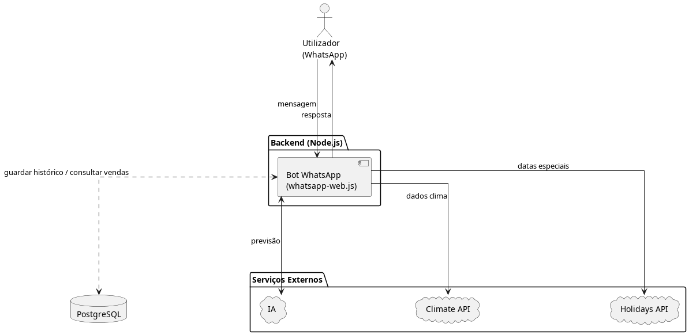

# Leena

Leena é uma assistente de vendas alimentada por IA, criada para apoiar comerciantes de mercados informais na decisão de compra para revenda. O foco é tornar decisões rápidas e assertivas, reduzindo desperdício e aumentando a margem de lucro.

---

## O que a Leena faz

- Analisa automaticamente o perfil do negócio e o stock actual do utilizador, sem necessidade de pedido explícito.
- Incorpora dados externos em tempo real: clima (via [wttr.in](https://wttr.in)) e feriados próximos (via [Nager.Date](https://date.nager.at)).
- Gera recomendações personalizadas sobre o que comprar, quais itens evitar e em que quantidades.
- Interage com o utilizador via WhatsApp através de um menu simples com opções predefinidas.

> **Nota:** Por agora, a Leena analisa apenas o perfil do utilizador e o stock actual. A análise do histórico de vendas será implementada numa fase futura.

---

## Público-alvo

- Camelôs e vendedores de barraca
- Lojistas de mercearias e minimercados
- Pequenos comerciantes de bairro que não utilizam sistemas ERP
- Empreendedores que precisam de apoio na gestão de stock e preço

---

## Menu de interacção

O utilizador navega pela Leena através de um menu fixo no WhatsApp:

```
1. Ver dicas de vendas
2. Actualizar stock de produtos
3. Ver meu perfil
4. Actualizar meu perfil
5. Fazer pergunta
6. Ajuda
7. Sair
```

As dicas de vendas **(opção 1)** são geradas automaticamente pela IA com base nos dados guardados na base de dados do utilizador — não é necessário descrever a situação, basta seleccionar a opção.

---

## Como funciona

1. O utilizador acede ao menu e selecciona uma opção (ex: `1. Ver dicas de vendas`).
2. A Leena consulta automaticamente o perfil e o stock do utilizador na base de dados.
3. Cruza esses dados com informações externas (clima actual e feriados próximos).
4. A IA processa tudo e gera uma recomendação personalizada.
5. A Leena responde com sugestões claras e alertas de risco directamente no WhatsApp.

---

## Valor para o utilizador

- Reduz perdas com stock parado e produtos perecíveis.
- Aumenta o giro de stock com reposição mais alinhada à procura real.
- Diminui compras impulsivas e exageradas.
- Permite planeamento antecipado com base em feriados, clima e sazonalidade regional.
- Interface simples via menu — não exige conhecimentos técnicos nem experiência com tecnologia.

---

## Arquitectura


---

## Tech Stack

| Camada           | Tecnologia                                      |
|------------------|-------------------------------------------------|
| Backend          | Node.js + Express                               |
| WhatsApp         | Baileys                                         |
| Base de dados    | PostgreSQL (hospedada no NeonDB)                |
| LLMs             | Gemini-2.0-flash-preview · Llama-3.3-70b (Groq) |
| API de clima     | wttr.in                                         |
| API de feriados  | Nager.Date                                      |
| Deploy backend   | Render                                          |
| Landing page     | HTML + CSS + JS (deploy na Vercel)              |
| Controlo de versão | Git + GitHub                                  |
---

## Privacidade e segurança

- Controlo total dos dados pelo utilizador.
- Partilha de dados apenas com consentimento explícito do utilizador.

---

## Licença

Este projecto está licenciado sob a [MIT License](LICENSE).